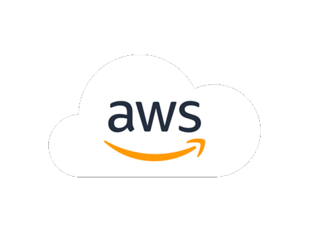

<center>



</center>

# AWS Baseline
Provisions a standard baseline VPC with a typical subnet setup. 

The following resources get created:
* VPC
* Internet Gateway
* Subnets
* NAT Gateways
* Route Tables
* Security Groups

## IP Addressing Considerations and Requirements
You will need to determine what CIDR block you want to use for the VPC. Try to think ahead and leave a cushion for any potential future growth.

> [!warning]  
> You **CANNOT** update the CIDR on the ```VPC``` or a ```Subnet``` once created! To modify an existing subnet you would have to detroy and recreate it, which means any resources built with that subnet would also need to be destroy and rebuilt.

| CIDR | Subnet Mask | IP Addresses |
|--|--|--|
| /19 | 255.255.224.0 | 8,192
| /18 | 255.255.192.0 | 16,384
| /17 | 255.255.128.0 | 32,768
| /16 | 255.255.0.0 | 65,536


## Understanding the Config
Some notes on the stacks config layout.....


